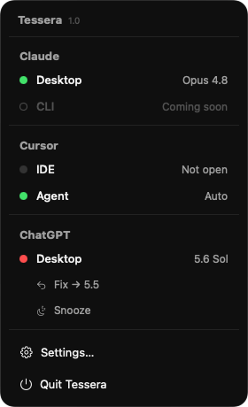

<p align="center">
  
</p>

<h1 align="center">Tessera</h1>

<p align="center">
  <em>A menu-bar watchdog that alerts when your AI tools drift off their expected model.</em>
</p>

<p align="center">
  <em>All local · no tracking · everything stays on your machine.</em>
</p>

---

<p align="center">
  
</p>

Tessera watches which model each of your AI apps is set to — Claude, Cursor,
ChatGPT — and notifies you the moment one drifts off the model you expect, so
you never burn a session on the wrong model by accident.

## Requirements

macOS 14 (Sonoma) or later.

## Install

```sh
brew tap d4r1as/tessera
brew trust d4r1as/tessera
brew install --cask tessera
```

Tessera isn't notarized yet, so macOS blocks it on first launch. Approve it once
via **System Settings → Privacy & Security → "Open Anyway"**, or run:

```sh
xattr -dr com.apple.quarantine "/Applications/Tessera.app"
```

## Uninstall

```sh
brew uninstall --cask tessera
```

## What it watches

| App | Sources |
| --- | --- |
| **Claude** | Desktop app _(Claude Code / CLI — coming soon)_ |
| **Cursor** | IDE window · Agent window |
| **ChatGPT** | Desktop app _(Codex or Chat)_ |

## How it works

1. Set an **expected model** per source in Settings — type it, or hit **Detect**
   to read the app's own model list into a dropdown.
2. When a source drifts, Tessera waits out a short **grace period**, then fires a
   notification.
3. **Snooze** it, or hit **Fix** to switch the app back to the expected model in
   one click. Re-fires are rate-limited so you're never spammed.
4. An optional **screen-edge alert** pulses a colored border while a source is
   off-model — for when a banner isn't enough.

Under the hood, Tessera reads each app's model picker through the macOS
Accessibility API — no private APIs, no injection. A small pure state machine
(`DriftReducer`) decides when a source has drifted long enough to alert.

## Permissions

| Permission | Why |
| --- | --- |
| **Accessibility** | *Read* the current model from your enabled apps. |
| **Notifications** | Alert you when a source drifts off its expected model. |

In the background Tessera only ever **reads** the model. It touches an app's
menus solely when you press **Detect** or **Fix**.

## Privacy

Everything stays on your Mac. Tessera has no account and no telemetry, and makes
**no** network connections — it reads model names locally and shows them in its
own menu, nothing more. See [PRIVACY.md](PRIVACY.md).
